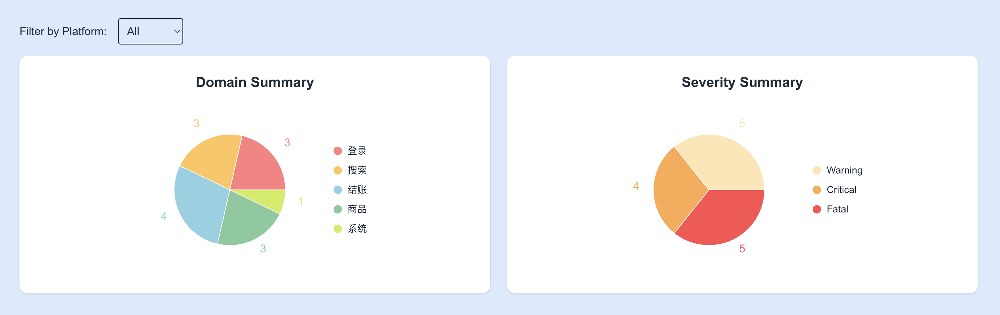
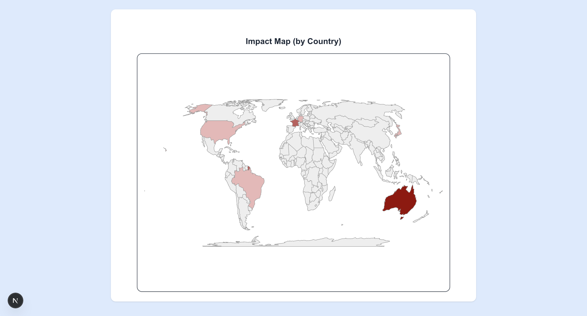
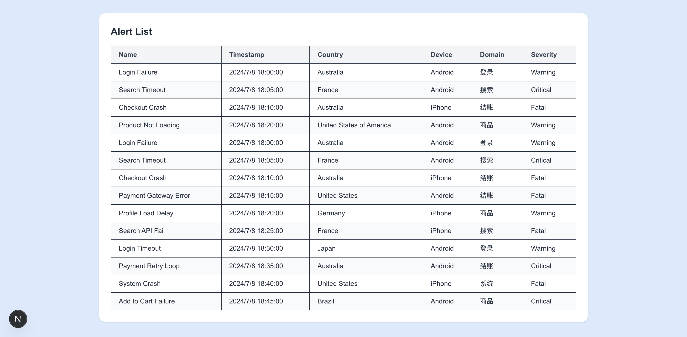

# 故障告警可视化系统

这是一个基于 **Next.js** 构建的交互式故障告警仪表盘，提供地图着色展示、饼图分析、交互表格、悬停提示等功能，帮助用户快速掌握各国家、平台、设备的异常情况分布。

---

## 功能

- **世界地图展示**
  - 根据国家告警数量显示颜色深浅
  - 鼠标悬停显示：国家名称、错误数量、设备种类、严重等级

- **饼图统计**
  - 展示不同平台（Domain）、严重程度（Severity）、设备类型（Device）的占比
  - 支持颜色自定义，交互友好

- **告警详情表格**
  - 展示平台、国家、设备、严重程度等字段信息

- **动态 Tooltip**
  - 地图上悬浮提示框，展示国家对应详细信息

---

## 技术栈

| 技术栈 | 描述 |
|--------|------|
| [Next.js](https://nextjs.org/) | React 全栈框架 |
| [Tailwind CSS](https://tailwindcss.com/) | CSS 框架，快速构建UI |
| [TypeScript](https://www.typescriptlang.org/) | 提升代码可维护性和类型安全 |
| [Recharts](https://recharts.org/) | 用于绘制饼图的图表库 |
| [react-simple-maps](https://www.react-simple-maps.io/) | 地图渲染组件，基于 SVG 和 TopoJSON |
| [topojson-client](https://github.com/topojson/topojson-client) | 地图数据处理 |

---

## 项目结构概览

```
- components/
  ├── PieCard.tsx         // 饼图卡片组件
  ├── WorldMap.tsx        // 世界地图组件
- data/
  └── alerts.ts           // 模拟告警数据
- types/
  └── alerts.ts           // 告警类型定义
- pages/
  └── index.tsx           // 主页面入口
```

---

## 本地运行

安装依赖

```bash
npm install
# 或者使用 yarn
yarn install
```

启动开发环境

```bash
npm run dev
```

访问地址：[http://localhost:3000](http://localhost:3000)

---

## 可拓展方向

- [ ] 时间范围筛选与趋势图表
- [ ] 地图点击跳转国家详情页
- [ ] 实时数据推送（WebSocket）
- [ ] 导出功能（Excel/PDF）
- [ ] 多语言支持

---

## 截图展示

### 饼图部分


### 世界地图


### 表格部分
